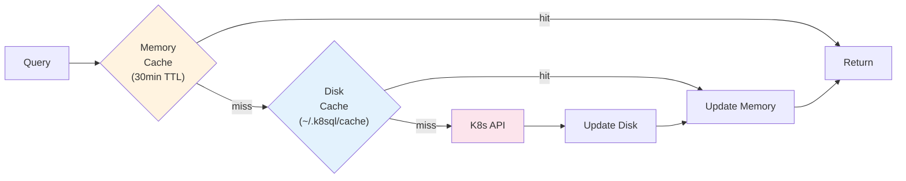

# k8sql Architecture

k8sql exposes the Kubernetes API as a SQL-compatible database using [Apache DataFusion](https://datafusion.apache.org/) as the query engine. It translates SQL queries into optimized Kubernetes API calls, converts JSON resources to Apache Arrow format, and streams results through DataFusion for filtering, projection, and aggregation.

## High-Level Architecture

```mermaid
flowchart TB
    subgraph UI["User Interface Layer"]
        REPL["REPL Mode<br/>(Interactive)"]
        Batch["Batch Mode<br/>(-q, -f)"]
        Daemon["Daemon Mode<br/>(PostgreSQL Wire)"]
    end

    subgraph QE["Query Engine Layer"]
        Context["K8sSessionContext"]
        Provider["K8sTableProvider"]
        Convert["JSON → Arrow"]
    end

    subgraph DS["Data Source Layer"]
        Pool["K8sClientPool"]
        Discovery["Resource Discovery"]
        Cache["Multi-Level Cache"]
    end

    subgraph K8s["Kubernetes Clusters"]
        C1["Cluster 1"]
        C2["Cluster 2"]
        CN["Cluster N"]
    end

    UI --> QE
    QE --> DS
    DS --> K8s
```

## Query Execution Flow

```mermaid
flowchart LR
    SQL["SQL Query"] --> Preprocess["Preprocess<br/>(fix ->> precedence)"]
    Preprocess --> DF["DataFusion<br/>Parse & Plan"]
    DF --> Provider["TableProvider<br/>Extract Filters"]
    Provider --> API["K8s API<br/>(with filters)"]
    API --> Stream["Stream Pages"]
    Stream --> Arrow["Convert to<br/>Arrow Batches"]
    Arrow --> DFExec["DataFusion<br/>Execute"]
    DFExec --> Format["Format Output"]
    Format --> Result["Results"]

    style SQL fill:#e1f5fe
    style Result fill:#c8e6c9
```

**Execution Steps**:

1. **Preprocess** - Fix JSON arrow operator (`->>`) precedence issues
2. **DataFusion Parse** - SQL parsing and logical plan creation
3. **TableProvider** - Extract pushable filters (namespace, labels, field selectors)
4. **K8s API Call** - Fetch resources with server-side filtering
5. **Stream Pages** - Paginated results (500 items/page) with early termination on LIMIT
6. **Convert to Arrow** - Transform JSON to typed Arrow RecordBatches
7. **DataFusion Execute** - Apply remaining filters, projections, aggregations
8. **Format Output** - Render as table, JSON, CSV, or YAML

## Architecture Layers

### User Interface Layer

| Mode | Entry Point | Description |
|------|-------------|-------------|
| **REPL** | `k8sql` | Interactive shell with auto-completion, syntax highlighting, and command history |
| **Batch** | `k8sql -q "..."` | Execute single query or file (`-f`), output to stdout |
| **Daemon** | `k8sql daemon` | PostgreSQL wire protocol server for tool integration (DBeaver, psql) |

### Query Engine Layer

**K8sSessionContext** wraps DataFusion's SessionContext, registering all discovered Kubernetes resources as tables. It provides JSON query functions (`json_get_str`, `json_get_int`, etc.) for accessing nested fields.

**K8sTableProvider** implements DataFusion's `TableProvider` trait, bridging SQL queries to Kubernetes API calls. It extracts filters from WHERE clauses and pushes them to the API:

| SQL Predicate | K8s API Optimization |
|---------------|---------------------|
| `namespace = 'x'` | Uses namespaced API endpoint |
| `labels->>'app' = 'nginx'` | Label selector: `app=nginx` |
| `labels->>'env' IN ('dev', 'prod')` | Set selector: `env in (dev,prod)` |
| `status->>'phase' = 'Running'` | Field selector (pods): `status.phase=Running` |
| `name = 'my-pod'` | Field selector: `metadata.name=my-pod` |
| `_cluster = 'prod'` | Query only that cluster |
| `_cluster = '*'` | Parallel query to all clusters |

### Data Source Layer

**K8sClientPool** manages connections to multiple Kubernetes clusters, supporting glob patterns (`prod-*`) and parallel queries.

**Resource Discovery** dynamically discovers all available resources including CRDs, generating consistent schemas with typed columns (timestamps, integers, JSON blobs).

**Caching Strategy**:
- **Memory cache** (30-min TTL): Fast lookup for resource registries
- **Disk cache** (`~/.k8sql/cache/`): Persists CRD schemas across restarts
- **Cluster CRD list**: Refreshed hourly to detect new/removed CRDs
- **CRD schemas**: Cached indefinitely (use `--refresh-crds` to force refresh)

## Module Reference

| Module | Path | Responsibility |
|--------|------|----------------|
| **main** | `src/main.rs` | Entry point, mode dispatch |
| **cli/args** | `src/cli/args.rs` | CLI argument parsing (Clap) |
| **cli/repl** | `src/cli/repl.rs` | Interactive REPL with completion |
| **daemon** | `src/daemon/` | PostgreSQL wire protocol server |
| **output** | `src/output/` | Result formatting (table, JSON, CSV, YAML) |
| **context** | `src/datafusion_integration/context.rs` | DataFusion session wrapper |
| **provider** | `src/datafusion_integration/provider.rs` | K8s TableProvider implementation |
| **convert** | `src/datafusion_integration/convert.rs` | JSON to Arrow conversion |
| **filter_extraction** | `src/datafusion_integration/filter_extraction.rs` | SQL filter extraction utilities |
| **execution** | `src/datafusion_integration/execution.rs` | Custom ExecutionPlan with streaming |
| **client** | `src/kubernetes/client.rs` | Multi-cluster connection pooling |
| **discovery** | `src/kubernetes/discovery.rs` | Resource discovery and schema generation |
| **cache** | `src/kubernetes/cache.rs` | Disk-based resource cache |
| **field_selectors** | `src/kubernetes/field_selectors.rs` | K8s field selector registry |
| **progress** | `src/progress.rs` | Progress reporting for async operations |
| **config** | `src/config.rs` | User configuration persistence |
